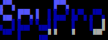

# SpyPro - The Automate
#### Author: *Djefferson Saintilus*


SpyPro automates the pentesting process from reconnaissance to target exploitation. It is designed for CTF (Capture The Flag) challenges and has an educational purpose. Currently, it supports Linux boxes, and it is recommended to keep a manual notebook for all notes and the final report. The tool follows the PTES (Penetration Testing Execution Standard) methodology. It is in English and utilizes the Kali Linux database to load most of the tools.

## Prerequisites
- `python3`

## Supported by:
- `Kali-Linux`
- `Parrot OS`

## Target Audience
- Pentesters
- Hackers
- CTF Players
- Ethical Hackers

## Installation

1. Clone the SpyPro repository:
```
git clone https://github.com/your-username/SpyPro.git
```
2. Install the required dependencies:
```
pip install -r requirements.txt
```
3. Start SpyPro:
```
python main.py
```

## 1. SpyPro v1.0 Features
_______________________________________________________
- OS detection (Linux or Windows) using TTL OS identifier
- Perform a global Nmap scan with version and state on a range of 65335 ports, followed by a targeted Nmap scan based on the previous results.

-- NEW UPDATE -- v1.1
- Web directory enumeration

to be continued ...

## Contributing

Contributions to SpyPro are welcome! If you have any suggestions, bug reports, or feature requests, please open an issue or submit a pull request.

## License

This project is licensed under the MIT License.

```

Feel free to modify and customize this overview to fit your project's specific details. Add sections, badges, or project-specific information as needed.

Remember to update the installation instructions, repository link, and other details to match your project's specific setup.

I hope this helps you create an engaging overview for your project!